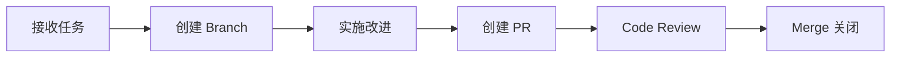

# 🎫 改进工单模板预览

## 方案 A: 互联网风格（推荐）⭐

**标题**: 
```
[HIGH] @programmer-agent 代码规范性待优化 | code_structure
```

**内容**:
```markdown
# 🎫 改进工单

> 💡 让代码更优雅，让系统更稳定

---

## 📊 基本信息

| 项目 | 内容 |
|------|------|
| **工单 ID** | `IMPROVE-20260309200500` |
| **优先级** | 🔴 HIGH |
| **乙方** | @programmer-agent |
| **甲方** | @coordinator-agent |
| **服务类型** | `code_structure` |
| **评分** | ⭐⭐ 2.0/5.0 |
| **创建时间** | 2026-03-09 20:05 |
| **触发方式** | GitHub Actions 自动化 |

---

## 🎯 问题描述

> 一句话总结：代码规范性不足，需要建立草稿区和正式区的分离

**详细反馈**:
代码规范性不足，需要建立草稿区和正式区的分离

---

## ✅ 改进目标

- [ ] **问题定位** - 分析具体原因，找出 root cause
- [ ] **方案设计** - 制定可执行的改进计划
- [ ] **快速迭代** - 实施改进，小步快跑
- [ ] **验证闭环** - 测试验证，确保效果

---

## 🚀 处理流程



**关键节点**:
1. **接收任务** - @programmer-agent 确认接单
2. **创建 Branch** - `fix/improve-20260309200500`
3. **解决问题** - 快速迭代，及时同步进度
4. **创建 PR** - 关联此 Issue (`Closes #`)
5. **Code Review** - 等待 @qa-agent 审核
6. **Merge 关闭** - 合并后自动关闭

---

## 📌 关键信息

**关联 Issue**: 无  
**依赖 PR**: 无  
**影响范围**: 代码结构、开发流程  

---

## 💬 沟通记录

> 在此添加评论，同步进度和讨论问题

---

**标签**: `improvement-ticket` `agent-feedback` `automated` `high-priority`

---

> 🌟 **让每一次改进都成为成长的阶梯！**
```

---

## 方案 B: 简洁专业风

**标题**:
```
[HIGH] programmer-agent 需要改进：code_structure
```

**内容**:
```markdown
# 🎫 改进工单：IMPROVE-xxx

**优先级**: 🔴 HIGH  
**乙方**: @programmer-agent  
**甲方**: @coordinator-agent  
**服务类型**: `code_structure`  
**评分**: ⭐⭐ 2.0/5.0  

---

## 📝 问题

代码规范性不足，需要建立草稿区和正式区的分离

## 🎯 改进项

- [ ] 分析问题原因
- [ ] 制定改进方案
- [ ] 实施并验证
- [ ] 文档更新

---

**处理流程**: 接单 → Branch → 实施 → PR → Review → Merge

**标签**: `improvement-ticket` `high-priority`
```

---

## 方案 C: 技术极客风

**标题**:
```
[HIGH] Fix code structure issues - programmer-agent
```

**内容**:
```markdown
## 🐛 Issue

**Type**: Improvement  
**Priority**: HIGH  
**Assignee**: @programmer-agent  
**Reporter**: @coordinator-agent  

---

## 📈 Metrics

| Metric | Value |
|--------|-------|
| Score | 2.0/5.0 |
| Severity | High |
| Effort | Medium |

---

## 📋 TODO

- [ ] Root cause analysis
- [ ] Solution design
- [ ] Implementation
- [ ] Testing & Verification

---

## 🔗 Links

- Branch: `fix/improve-xxx`
- PR: TBD
- Related: TBD
```

---

## 🎯 我的推荐

**方案 A（互联网风格）** 最适合你的场景：

### 优势
- ✅ **清晰专业** - 表格化信息，一目了然
- ✅ **互联网范儿** - 用词现代化，符合技术团队风格
- ✅ **流程明确** - 有流程图，有 checklist
- ✅ **易于追踪** - 关键信息突出
- ✅ **友好但不失严谨** - 有温度但不随意

### 特点
- 📊 表格展示基本信息
- 🎯 问题描述清晰
- ✅ Checklist 明确改进项
- 🚀 流程图展示处理流程
- 💬 预留沟通区域
- 🌟 正能量的结尾

---

## 🤔 你选哪个？

**选项 A**: 互联网风格（推荐）⭐  
**选项 B**: 简洁专业风  
**选项 C**: 技术极客风  
**选项 D**: 混合以上元素，自定义

**告诉我你的选择，我立即更新工作流文件！** 🚀
